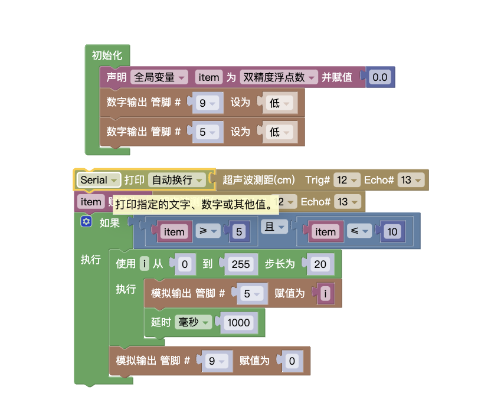

## 试题

### 主题:距离指示器
器件:
LED 灯模块2个(分别为 LED_A和 LED_B)，超声波传感器1个，舵机1个(也可使用分立器件结合面包板搭建)

要求:
* 通过超声波传感器检测距离的变化，并根据检测距离控制舵机的转动角度和 LED 灯的亮灭.
* 将超声波传感器检测的距离值显示在串口监视器。
* 当超声波传感器检测的距离为 10cm时,舵机处于 90度位置，LED_A和 LED_B均熄灭
* 当超声波传感器检测距离为5cm时,舵机处于0度位置，LED_A 闪烁，LED_B 熄灭,
* 当超声波传威器检测的距离在10cm至5cm之间变化时,舵机的转动角度为 90~0度所对应的角度,LED_A从熄灭至最亮LED_B 保持熄灭状态。
* 当超声波传感器检测距离为15cm时,舵机处于180度位置,LED_B闪烁，LED_A熄灭.
* 当超声波传感器检测的距离在 10cm至15cm之间变化时,舵机的转动角度为 90~180 度所对应的角度,LED_B从熄灭至最亮，LED_A保持熄灭状态。
* 根据上述要求，绘制流程图.

### 解析

#### 第一步

这里我们看到一个最简单的`要求2` 使用串口监视器打印距离
`要求3` `要求4`比较简单，只需对距离判断，分情况处理即可。

#### 第二步

`要求5` `要求7`思路一样。这里我门看到距离变化时，舵机也跟随转动，同时LED_A从`熄灭到最亮`这里有亮度的变化，所以需要使用的`PWM`

:::info

`PWM`
脉宽调制（Pulse-Width Modulation，PWM）是利用微处理器的数字输出，来对模拟电路进行控制的一种非常有效的技术，通过对一系列脉冲的宽度进行调制，来等效的获得所需要的波形（含形状和幅值），即通过改变导通时间占总时间的比例，也就是占空比，达到调整电压和频率的目的

:::

> 上边是`pwm`的定义，其实通俗来讲，什么时候使用`pwm`，当出现<Highcolor color='skyblue' textcolor='white'>连续变化 也就是多种状态</Highcolor>就需要使用。

:::tip

Arduino Uno 开发板上数字前带有`~`标志的就是pwm管脚

:::

这里需要将超声波传感器检测到的距离`映射`到舵机旋转的角度上，同时使用pwm调整LED_A的亮度变化。

这里我使用`变量`存储超声波检测的距离，同时用映射将距离转化为舵机的角度，最后用`for循环`将`局部变量i`作为LED_A的亮度

### 总结

