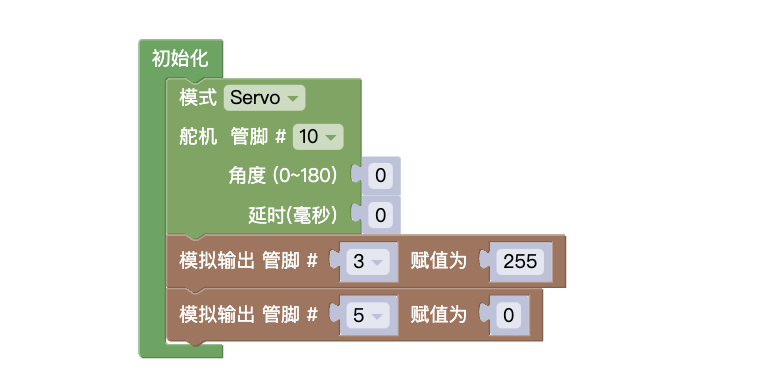
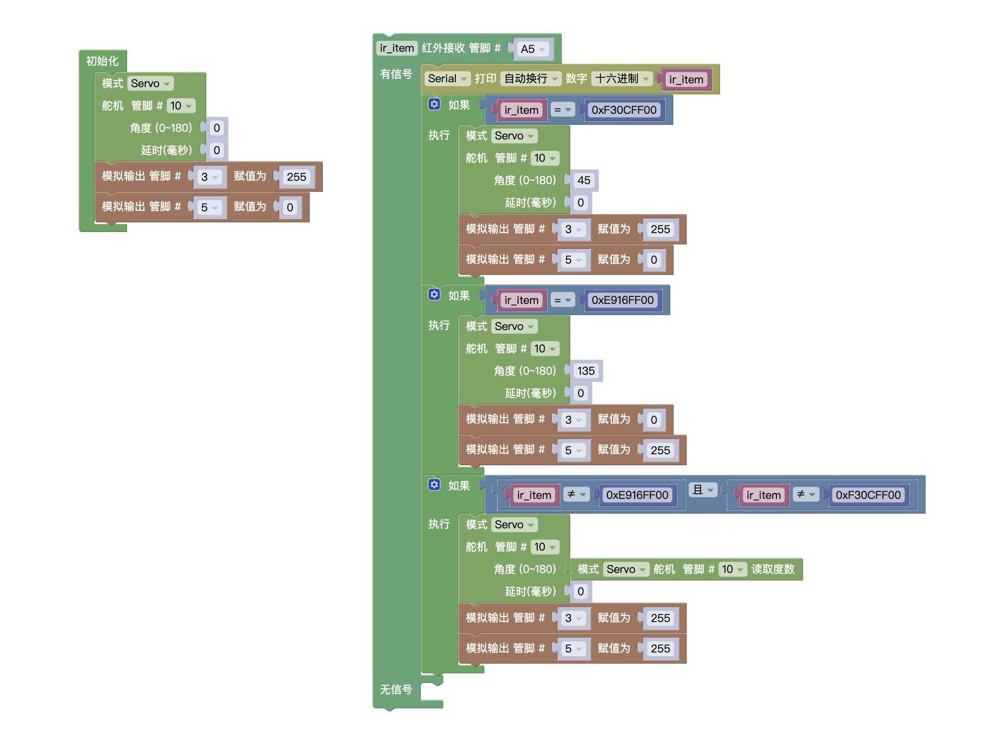

## 试题

### 主题: 红外遥控门锁

器件:Atmega328P 主控板1块,LED 模块2个(LED_A和 LED_B),红外遥控器和红外接收模块各1个,舵机1个及相应辅件。
以上模块也可使用分立器件结合面包板搭建。
任务要求:
通过红外遥控器控制舵机的转动，当舵机处于不同的转动位置时，分别表示门锁的打开和关闭。具体任务说明及要求如下:
* 当舵机处于 45度位置时，表示门锁处于关闭状态;当舵机处于 135 度位置时，表示门锁处于打开状态.
* 当门锁处于关闭状态时，LED A点亮，LED B熄灭、
* 当门锁处于打开状态时，LED_A熄灭，LED B 点亮。
* 当项目装置启动时，门锁默认处于关闭状态.
* 当点击红外遥控器的"1"键时，门锁打开
* 当点击红外遥控器的"2”键时，门锁关闭.
* 当点击红外遥控的其它按键时,门锁不做反应,此时 LED_A和 LED B均点亮。
* 根据上述要求，绘制流程图。

### 解析

在做本套试题时，需要注意结合试题要求来看，`要求1`，`要求2`，`要求3`可以归为一个任务。需要注意装置的初始化,关闭同时要将关闭的操作做完。

### 原理

### 总结

