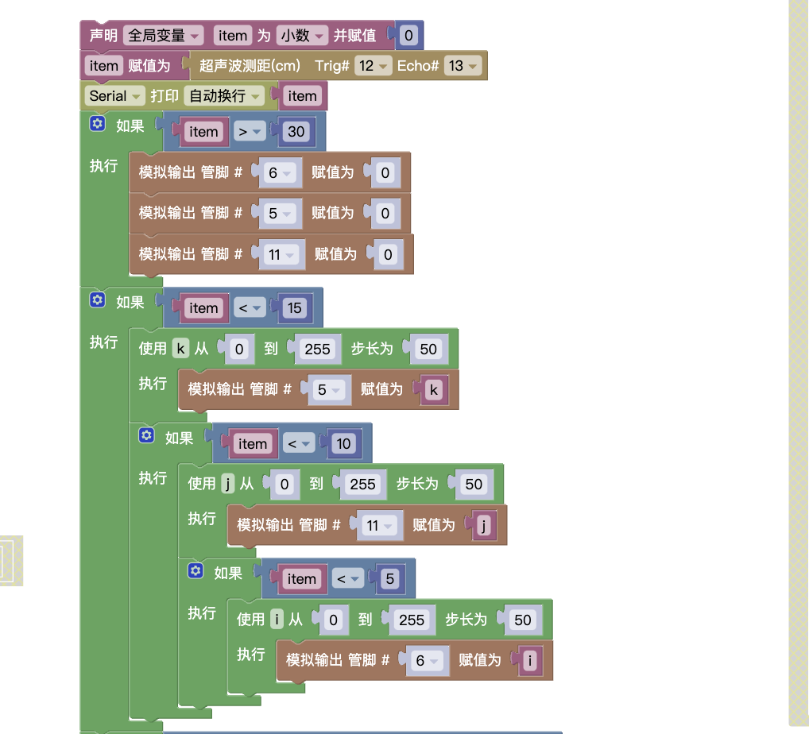

## 试题

### 主题:超声波测距

器件:ATmega328 控制板1个，LED 灯模块3个，超声波传感器1个，结构件若干(也可使用普通电子元器件结合面包板搭建)任务要求:
* 本项目由 LED灯，超声波传感器组成;
* 当障碍物距离超声波传感器 30 厘米以外时,3 盏 LED 灯处于熄灭状态
* 当障碍物与超声波传感器波距离逐渐接近时,随着距离的接近,3盏LED 灯被依次点亮(距离值由考生自行决定);
* 要求每盏 LED灯被点亮时有一个渐变的过程,如第1盏 LED 灯从熄灭逐渐变为最亮之后,第2盏 LED 灯才开始逐渐点亮,依次类推，全部 LED 灯都被点亮;
* 当障碍物与超声波传感器距离逐渐远离时,3 盏LED 灯被依次熄灭;
* 要求每盏 LED灯被熄灭时有一个渐变的过程,如第3盏LED 灯从最亮逐渐熄灭之后,第2盏 LED 灯才开始被逐渐熄灭,依次类推，全部 LED 灯都被熄灭;
* 可使用任意结构件搭建;
* 根据要求绘制流程图;
* 未作规定处可自行处理，无明显与事实违背即可.
### 解析

这里需要注意渐变的过程，**`依次点亮同时距离发生变化`**。这里我使用嵌套判断，注意比较的`顺序`。

### 原理

### 总结

