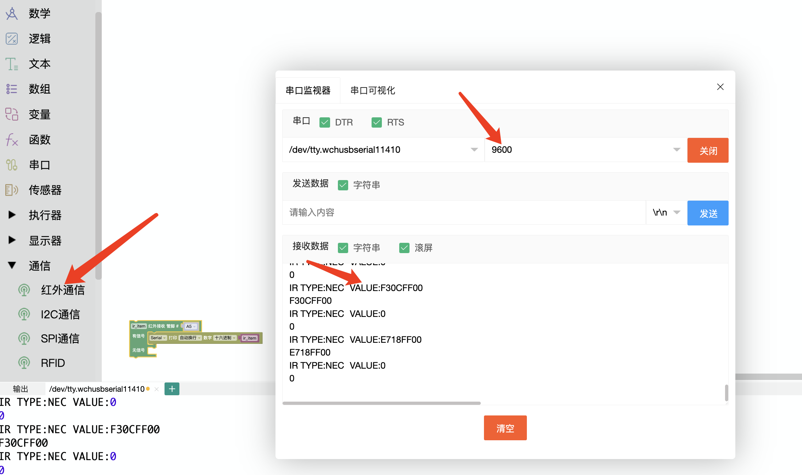

## 试题

### 主题:遥控灯光秀
器件:ATmega328 控制板1个，LED 灯模块2个,红外遥控器(发射装置)1个，红外接收模块1个，电位器1个，结构件若干(也可使用普通电子元器件结合面包板搭建入任务要求:
* 本项目由红外遥控器、红外接收模块、LED 灯、电位器组成
* 通过红外遥控器可以控制LED 灯的状态;
* 控制板上电，两盏 LED 灯保持熄灭状态;
* 按下遥控器1号键(也可以自定义按键,只要符合要求的效果即可),第一盏 LED 灯点亮(第二盏 LED 灯熄灭);
* 按下遥控器2号键,第二盏 LED 灯点亮(第一盏LED 灯熄灭);
* 按下遥控器3号键，两盏LED 灯都被点亮;
* 按下遥控器4号键,可以开启电位器控制，旋动电位器调节 LED 灯亮度;
* 按下遥控器5号键，可以实现两盏LED 灯交替闪烁;
* 按下遥控器0号键，可以停止交替闪烁效果，同时熄灭两盏LED 灯;
* 可使用任意结构件搭建;
* 根据要求绘制流程图;
* 未作规定处可自行处理，无明显与事实违背即可。
### 解析
> 红外接收与处理，对不同按键编码的处理，这里如果不知道你的按键编码，可以使用串口打印，查看

`VALUE:FF30CF`value后边即为对应按键的编码，具体可以看串口打印

这里我们看到要使用电位器控制灯的亮度，此时灯的亮度是`连续变化`的，就需要使用`PWM`和`映射`将电位器的数值映射到灯的亮度上。灯的数值范围是0-255，电位器数值是0-1023

### 原理

### 总结
