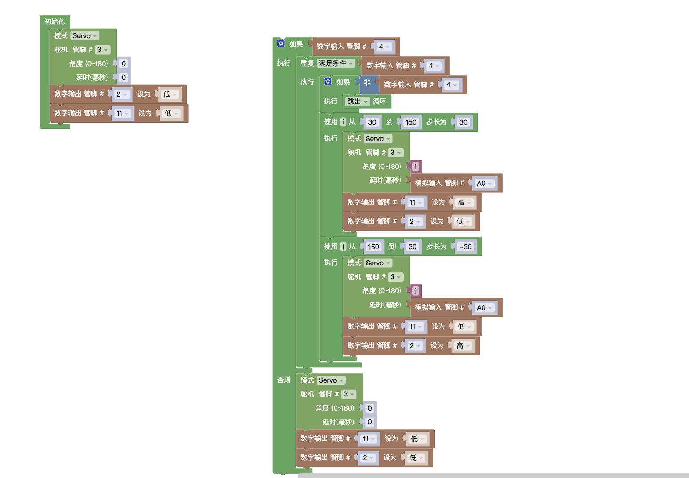

## 试题

### 主题:模拟雨刷器

器件:ATmega328 控制板1个，电位器模块1个，按键模块1个，LED 灯模块2个，舵机1个，结构件若干(也可使用普通电子元器件结合面包板搭建)

要求:
* 本项目由电位器、按键、LED 灯(分别命名为LED1和 LED2) 舵机组成;
* 控制板上电，LED1和LED2皆保持熄灭状态，舵机角度为0度:
* 按下按键(手不松开)，舵机角度在 30~150 度之间反复摆动;
* 当舵机在从30度向150度转动过程中 LED1点亮，LED2熄灭
* 当舵机在从150度向30度转动过程中 LED1熄灭，LED2点亮;
* 此时，使用电位器可以调节舵机摆动的速度;
* 松开按键,舵机转到0度，LED1和 LED2 皆熄灭;
* 可使用任意结构件搭建;
* 根据要求绘制流程图;
* 未作规定处可自行处理，无明显与事实违背即可.
### 解析

本题重点在于将电位器映射到舵机上。这里需要知道电位器需要接入到`模拟输入`上,也就是Arduino Uno板上边的`A0-A5`，任意一个就可以。

这里需要注意的是舵机往复运动时，我们使用`for循环`里的`局部变量i` `局部变量j`作为舵机旋转的角度。这里的延时一定要加可以给小一点，不然你会看到舵机抽搐😐.

> 电位器 它的数值范围是0～1023 这里我们可以使用映射，将这个数值作为舵机的延时，以此实现控制舵机摆动速度。

### 原理
* 初始化
* 映射
* 条件判断
* 循环中断

### 总结
所有代码如下

