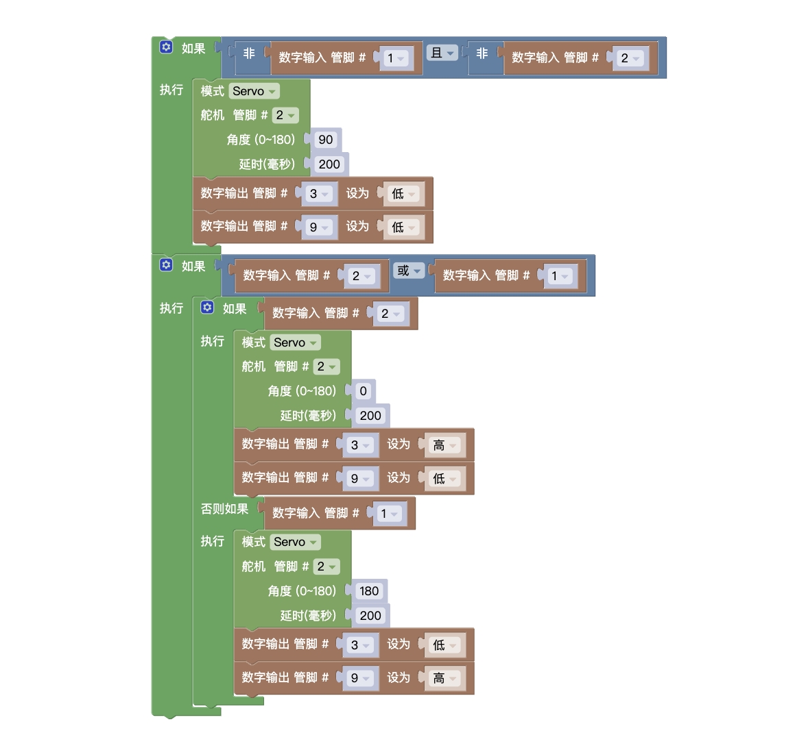

## 试题
### 主题:抢答器

Atmega328P 主控板1块,按键模块2个(A键和B键) LED 模块2个(LED_A和LED_B),舵机1个及相应辅件。以上模块也可使用分立器件结合面包板搭建。
要求:
抢答器由A、B双方组成,分别位于左右两侧,A方包含1个按键模块(A键)和1个 LED 模块(LED_A),B方包含1个按键模块(B键)和1个LED 模块(LED_B)，舵机位于双方的中间位置，用于指向抢答获胜选手。具体任务说明及要求如下:
* 初始状态:当A键和B键没有按下时,LED_A和 LED_B均处于熄灭状态,舵机舵盘指向 90 度位置:
* 抢答开始后，率先按下按键一方的 LED 灯点亮,另一方 LED 灯保持熄灭状态。舵机舵盘指向抢答获胜一方;
* 当A键和B键再次释放时，LED 灯和舵机回到初始状态;
* 根据要求绘制流程图;
* 未作规定处可自行处理，无明显与事实违背即可。

### 解析
本题重点在于抢答的处理，只要有一方按下按钮，即为抢答成功，这里用到了`逻辑或`---只需要一个条件满足就成立。因此需要在执行里对具体的按钮判断，到底是谁按下按钮。
### 原理
* 逻辑或
* 多分支结构--- `如果，否则如果`
### 总结

