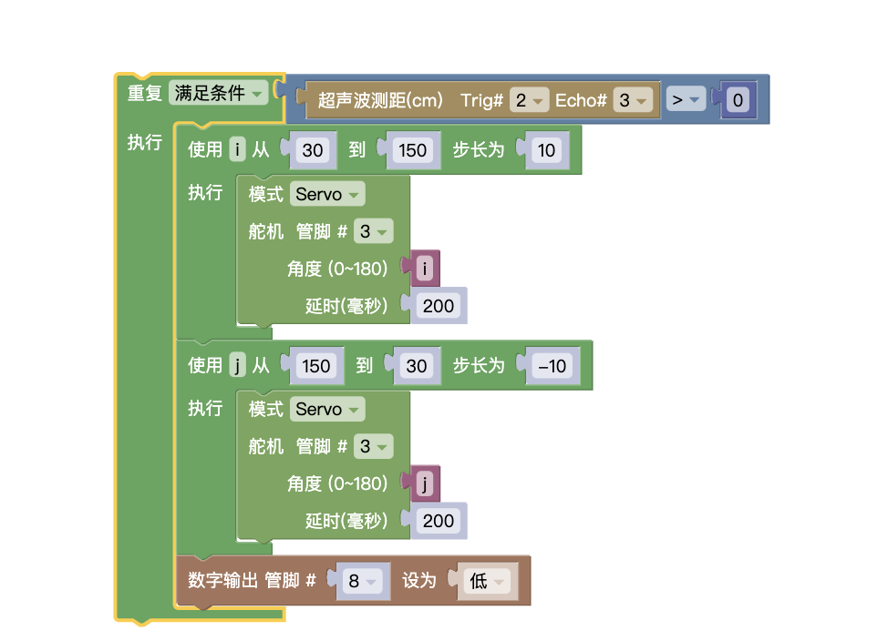
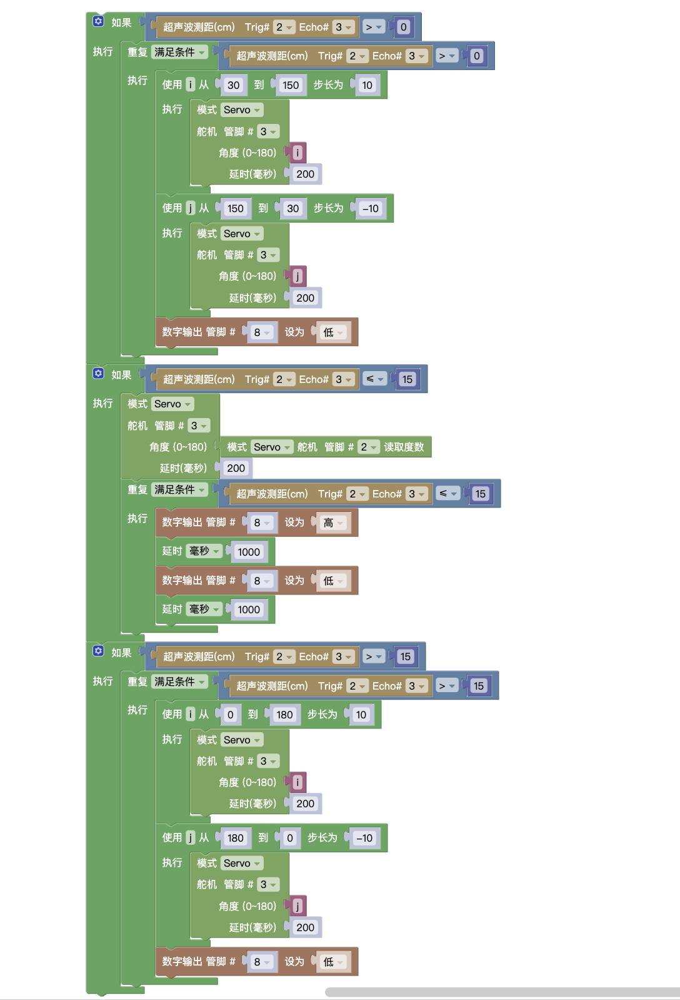

## 试题

### 主题:预警雷达
器件:Atmega328P 主控板1块，舵机1个，超声波传感器1个，LED 灯1个及相应辅件。以上模块也可使用分立器件结合面包板搭建。
预警雷达主要由往复转动的舵机以及与舵机连接在一起的超声波传感器组成，
装置工作时，舵机在 30 度至 150 度之间往复转动。
在转动过程中，超声波传感器不断检测不同角度时前方障碍物的距离，LED 灯用于信息指示,

要求如下:
* 当超声波传感器检测的障碍物距离大于 15 厘米时,装置不做反应,舵机在 30 度至 150 度之间往复转动,LED 灯熄灭;
* 当超声波传感器检测的障碍物距离不大于 15 厘米时,舵机在该角度停止,LED 灯闪烁,用于警示障碍物靠近,容易发生事故;
* 当障碍物远离，且距离大于 15厘米时，舵机继续开始往复摆动，LED 灯熄灭;
* 根据上述要求，绘制流程图;
* 未作规定处可自行处理，无明显与事实违背即可.

### 解析
本题比较简单，还是对多种情况的处理，舵机的往复运动。直接看代码

### 原理
* 有限循环 `for`
* 条件循环 `while 条件`
### 总结

全部代码如下

