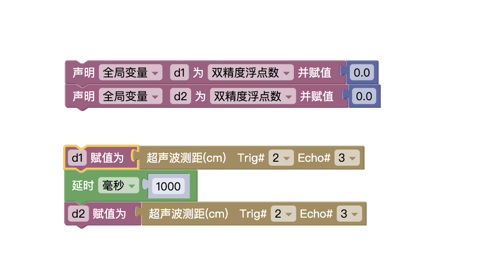
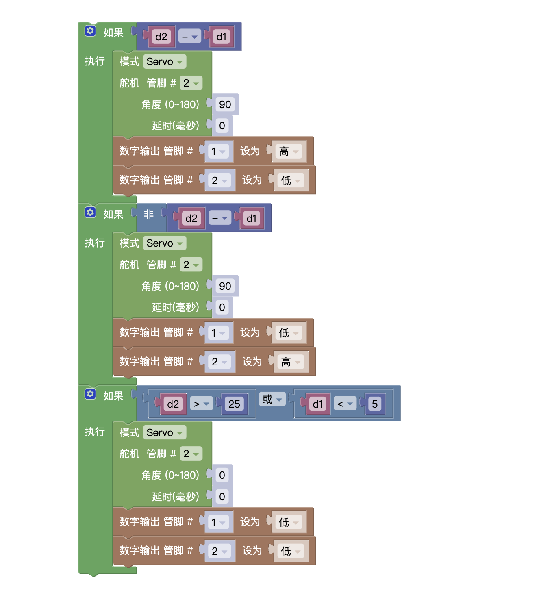
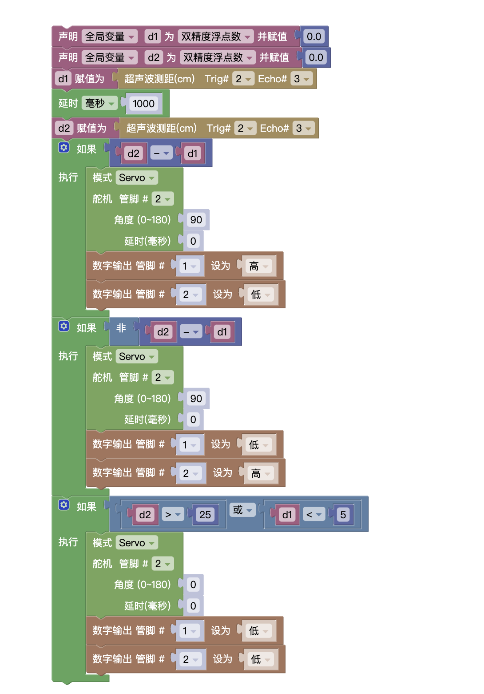

## 试题

### 主题:智能门栏

器件: Atmega328P 主控板1块，舵机1个，超声波传感器1个,LED灯2个(分别为 LED A和 LED_B)及相应辅件。以上模块也可使用分立器件结合面包板搭建。
任务要求 :

采用超声波传感器感应人的进出，感应范围为5-25cm。采用舵机实现栏杆的功能。
智能门栏将通道分为外部和内部，其主要任务要求如下:

* 当感应区内没人时，栏杆放下，位于水平位置，LED_A和 LED_B均熄灭;
* 当有人从**外部**进入感应区时，栏杆抬起，处于 90 度位置，同时 LED_A点亮，LED_B 熄灭;
* 当有人从**内部**进入感应区时，栏杆抬起，处于90度位置，LED_B点亮，LED_A熄灭;
* 根据上述要求，绘制流程图;
* 未作规定处可自行处理，无明显与事实违背即可。

### 解析

我们看到这题，都会感觉很熟悉，大家都见过。那我们根据现象分析问题。难度不大，重点在于如何区分<Highcolor color='red'>内部</Highcolor>  <Highcolor color='red' >外部</Highcolor>
下边我用一张图来说明如何判断是**内部**还是**外部**

由上图的两个过程可以看出，人的位置是在实时变化的。而超声波可以检测出距离，那我们就可以根据两个时刻人的距离来判断是内部还是外部。

#### 原理如下
:::info
记 t1 时刻 人的距离为d1 = 20
记 t2 时刻 人的距离为d2 = 10

那么就有 `d2 - d1 = -10 < 0`

记 t1 时刻 人的距离为d1 = 10
记 t2 时刻 人的距离为d2 = 20

那么就有 `d2 - d1 = 10 > 0`

:::

假如t1是第一次记录，t2是第二次记录，那我们很明显发现两次的结果刚好相反。也就是当`d2 - d1 > 0`时我们认为他是从内部到外部，他的距离越来越远。
`d2 - d1 < 0`时认为他是从外部到内部，距离越来越近。

##### 第一步

有了原理后，再来具体实现，距离需要用变量存，所以我们需要两个变量，就记为d1,d2,两个距离要有一定的时间间隔。

##### 第二步

> 条件处理

分析题意可知一共有三种条件

* 内部
* 外部
* 不在感应区 （距离大于25或者距离小于5）

下图中分别对应`内部` `外部` `不在感应区`

### 总结

最后全部代码如下

