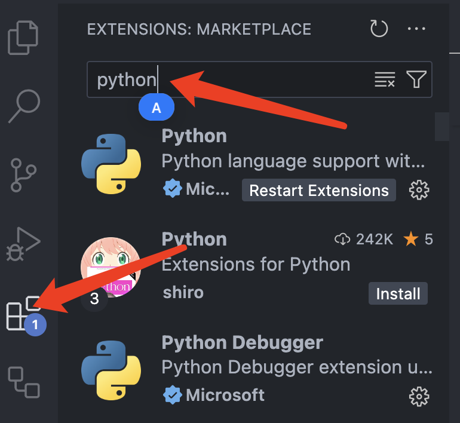

### 准备工作

工欲善其事，必先利其器。

python成功下载后，以后我们进行python开发时需要一个开发环境。python自带有<Highcolor color='black'>[IDLE](https://docs.python.org/zh-cn/3/library/idle.html)</Highcolor>

为了更方便使用，我们使用更为简洁美观的[vscode](https://code.visualstudio.com/)

:::tip
具体安装教程请在[bilibili](https://www.bilibili.com/)上搜索
:::

下载完成后，我们先通过安装扩展方式，将vscode界面变成汉语

这里我安装的是python**扩展**，要想汉化，只需将python换成Chinese，再点击`install`即可。安装后可能会需要先关闭后打开才能汉化。

### 了解
:::note 编辑器和IDE的区别

编辑器通常是一个相对轻量级的工具，主要侧重于文本的编辑。它们提供了基本的文本编辑功能，如打开、保存、查找和替换等，适用于简单的文本编辑任务。编辑器不包含代码智能提示、调试器或编译器等高级功能，因此它们通常比IDE更加轻便，易于使用。例如，Vim和Emacs就是非常流行的编辑器，它们提供了大量的文本编辑功能，但需要用户自行配置以适应不同的编程需求。

IDE（集成开发环境）则是一个功能丰富的工具，集成了代码编辑器、编译器、调试器等多种开发工具于一体。IDE提供了代码智能提示、代码自动完成、项目管理和调试等功能，非常适合进行复杂的软件开发工作。IDE通常具有一个图形用户界面（GUI），使得开发人员可以直观地管理和组织他们的代码和项目。例如，Eclipse和Visual Studio Code（VS Code）都是流行的IDE，它们提供了丰富的功能来支持各种编程语言的开发

:::